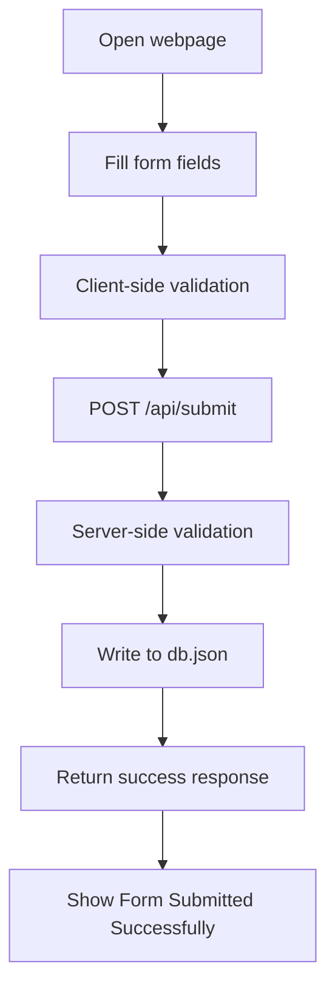
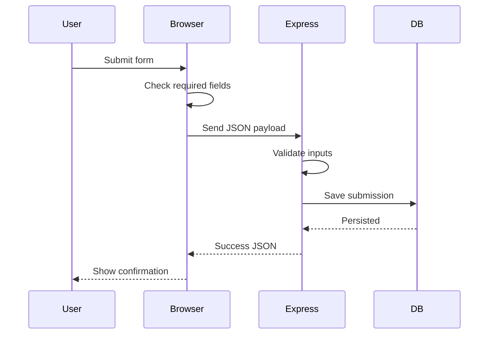

# She Can Foundation Contact Form

A clean, responsive full-stack internship project for **She Can Foundation**. The app collects a name, email address, and message, validates the form on both client and server, stores the submission in `db.json`, and confirms success with the message **Form Submitted Successfully**.

## Project Overview

This project is intentionally simple, but complete. It demonstrates a working browser form, an Express backend, and lightweight persistent storage without requiring any external database service.

## Tech Stack

- Frontend: HTML5, CSS3, Vanilla JavaScript
- Backend: Node.js, Express.js
- Storage: Local JSON file database (`db.json`)

## Project Structure

```text
scf/
├─ server.js
├─ db.json
├─ package.json
├─ README.md
├─ architecture.md
├─ projectdocumentation.md
└─ public/
   ├─ index.html
   ├─ style.css
   └─ app.js
```

## Workflow



## Execution Flow



## Setup and Installation

### Prerequisites

- Node.js 18+ recommended

### Install Dependencies

```bash
npm install
```

### Run Locally

```bash
npm run dev
```

Or run the standard server command:

```bash
npm start
```

### Open in Browser

```text
http://localhost:3500
```

## Usage Instructions

1. Open the site in your browser.
2. Enter your name, email, and message.
3. Click Submit.
4. Wait for the success confirmation.

## Validation and Testing Notes

- Empty fields are blocked by both the frontend and backend.
- Invalid email addresses are rejected.
- Successful submissions are appended to `db.json`.
- Re-running the server keeps previously stored data intact.

## Documentation

- [Architecture](architecture.md)
- [Project Documentation](projectdocumentation.md)

## Notes

The app is deliberately focused on the internship requirement: a simple, reliable, responsive form with backend persistence and clear documentation.
