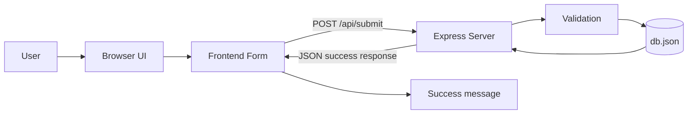
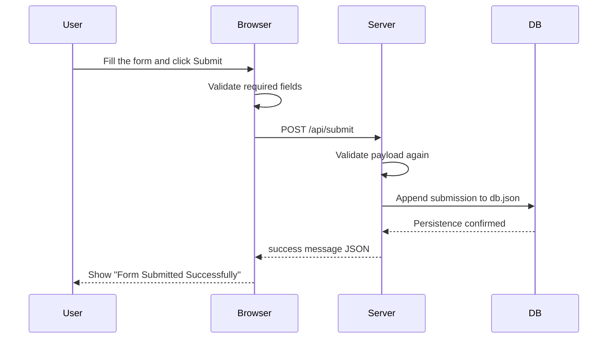
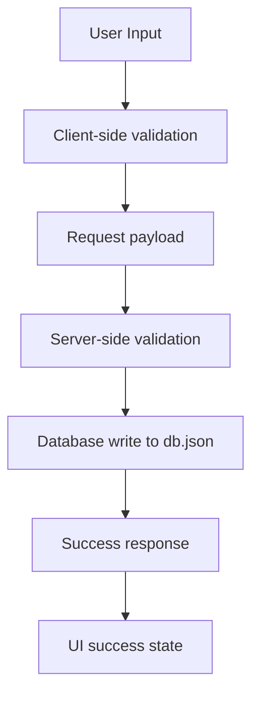

# Architecture Document

## 1. Objective

The goal of this project is to provide She Can Foundation with a clean, responsive, and fully working contact form application. The system collects a name, email address, and message, validates the payload, stores the submission in a lightweight JSON database, and confirms success to the user with the message: `Form Submitted Successfully`.

## 2. High-Level Architecture

The solution uses a simple full-stack structure:

- Frontend: static HTML, CSS, and Vanilla JavaScript
- Backend: Node.js with Express
- Storage: local JSON file (`db.json`)

## 3. Component Breakdown

### Frontend

The frontend is responsible for presenting the form, performing immediate client-side checks, and displaying the success or error state.

Responsibilities:

- Render a responsive layout
- Capture form input
- Validate empty and invalid values before submit
- Send data to the backend with `fetch`
- Show the backend response clearly

### Backend

The backend receives the form submission, validates it again, writes it into storage, and returns a structured JSON response.

Responsibilities:

- Serve the static site
- Validate incoming payloads
- Persist valid submissions to `db.json`
- Return consistent API responses

### Storage

The storage layer is a file-based JSON database. It is intentionally simple for internship evaluation and easy local execution.

Responsibilities:

- Keep submission data persistent between server restarts
- Store each record as an object in a submissions array
- Avoid setup complexity from external databases

## 4. Execution Flow

## 5. Data Flow

## 6. Design Choices

### Why Express

Express keeps the backend small, readable, and easy to maintain while still supporting static file hosting and JSON APIs.

### Why JSON File Storage

The internship task does not require a production database. A local JSON file is enough to demonstrate backend integration and persistence with almost zero setup overhead.

### Why Vanilla JavaScript

Vanilla JavaScript keeps the project easy to run and review. It also makes the form logic transparent without relying on a framework build step.

## 7. Advantages

- Very easy to install and run
- Minimal dependencies
- Strong clarity for reviewers
- Works well for small form-based applications
- Persists data locally

## 8. Limitations

- JSON file storage is not ideal for high concurrency
- No advanced authentication or admin workflows are included in the simplified version
- Data management is basic compared with a relational database

## 9. Integration Notes

- Frontend communicates with the backend using `fetch`
- Backend responds with structured JSON and HTTP status codes
- The `db.json` file is created automatically if missing
- Client and server both validate user input to reduce bad submissions

## 10. Verification Strategy

Recommended checks:

1. Open the site in a browser and confirm the form renders correctly.
2. Submit empty values and confirm validation messages appear.
3. Submit a valid name, email, and message.
4. Confirm the page shows `Form Submitted Successfully`.
5. Verify a new entry appears inside `db.json`.
6. Restart the server and confirm stored data remains available.
