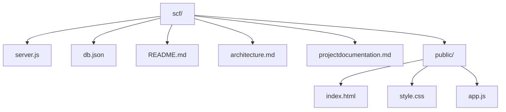
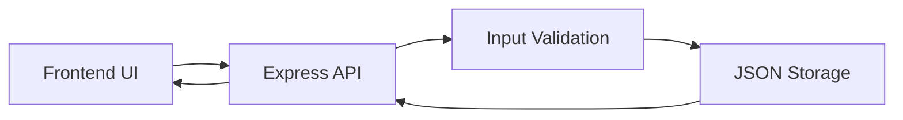
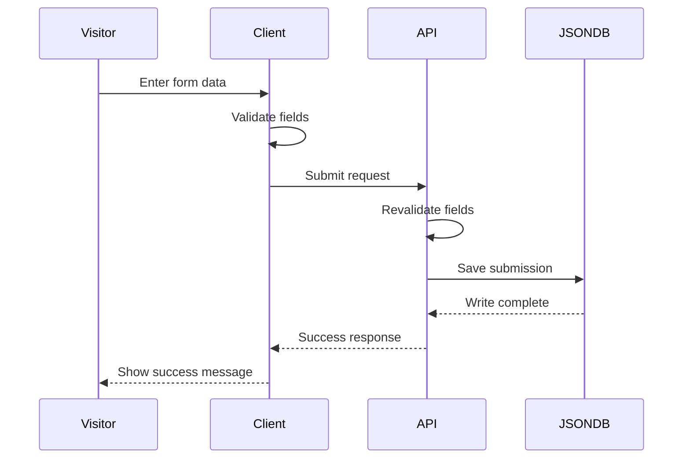

# Project Documentation

## 1. Project Summary

She Can Foundation Internship Task is a compact full-stack application that collects a user message through a responsive contact form. The backend validates the input, stores it in a local JSON database, and returns a success message to the browser.

## 2. Main Objective

The objective is to demonstrate a complete but simple web application that proves frontend, backend, and storage integration in a way that is easy to understand and verify.

## 3. Core Features

- Responsive single-page form
- Name, email, and message fields
- Client-side and server-side validation
- JSON file-based persistence
- Success message after submission

## 4. File Structure



## 5. Folder and File Responsibilities

### server.js

Defines the Express server, static hosting, validation logic, and the `POST /api/submit` endpoint.

### public/index.html

Provides the semantic structure of the landing page and the form.

### public/style.css

Creates the visual language, layout, responsive behavior, and form states.

### public/app.js

Handles form validation, request submission, and status messaging.

### db.json

Stores every accepted submission as JSON.

## 6. Workflow Explanation

1. The user opens the webpage.
2. The form is displayed with responsive layout and clear labels.
3. The user enters a name, email, and message.
4. The browser checks the data locally before submission.
5. The form sends the payload to the Express backend.
6. The backend validates the data again and writes it to `db.json`.
7. The backend returns `Form Submitted Successfully`.
8. The frontend displays the confirmation state.

## 7. System Architecture



## 8. Technology Stack

### Frontend

- HTML5 for structure
- CSS3 for layout and responsiveness
- Vanilla JavaScript for interaction

### Backend

- Node.js for runtime
- Express.js for routing and static hosting

### Storage

- Native JSON file storage

## 9. Why This Stack Was Chosen

- It is lightweight and easy to review.
- It requires no special database installation.
- It matches the task requirement for a simple full-stack implementation.
- It works well on Windows without extra configuration.

## 10. Problem-Solving Approach

The app was designed to reduce risk and complexity.

- Validate early in the browser to improve user experience.
- Validate again on the server to protect the stored data.
- Keep persistence local and deterministic with a JSON file.
- Use a single API endpoint so the integration surface stays small.

## 11. Pros and Cons

### Pros

- Fast to set up
- Easy to understand
- Fully functional for the internship use case
- Clear submission flow

### Cons

- Not suitable for large-scale production data storage
- No advanced account system or admin dashboard in this simplified version
- Limited concurrency handling compared with a real database

## 12. Data and Execution Flow



## 13. Integration Details

- The frontend sends `name`, `email`, and `message` as JSON.
- The backend trims and validates those values.
- The backend stores each record with an id and timestamp.
- The response is JSON so the UI can react without a page reload.

## 14. Setup Instructions

### Prerequisites

- Node.js installed locally

### Installation

```bash
npm install
```

### Run in Development

```bash
npm run dev
```

### Run in Production Mode

```bash
npm start
```

### Open in Browser

Visit:

```text
http://localhost:3500
```

## 15. Validation Checklist

- Form renders without console errors
- Required fields show validation if empty
- Invalid email is rejected
- Valid submission returns success message
- Data appears in `db.json`
- Reloading the server preserves data
